# 🖼️ Processamento Digital de Imagens

Implementação manual dos principais algoritmos de PDI — sem funções de alto nível como `cv2.equalizeHist` ou `cv2.filter2D` — cobrindo operações no **domínio espacial**, no **domínio da frequência** e **simulação/remoção de ruídos**.

Desenvolvido como exercício prático da disciplina de **Processamento de Imagem e Visão Computacional (PIVC)** — UERN.

---

## 📁 Estrutura do Projeto

```
pdi-filtros/
├── src/
│   ├── filtros_exercicio.py   # Transformações e filtros base
│   └── simular_ruido.py       # Simulação e remoção de ruídos
├── assets/
│   ├── filtros/               # Imagens geradas por filtros_exercicio.py
│   └── ruidos/                # Imagens geradas por simular_ruido.py
│       └── original.jpg       # ← coloque sua imagem de entrada aqui
└── README.md
```

---

## 📋 Sumário

- [Pré-requisitos](#pré-requisitos)
- [Como Executar](#como-executar)
- [Script 1 — Filtros e Transformações](#script-1--filtros-e-transformações-filtros_exerciciopy)
  - [Imagem Original](#1-imagem-original)
  - [Escala de Cinza](#2-conversão-para-escala-de-cinza)
  - [Binarização](#3-binarização)
  - [Alargamento de Histograma](#4-alargamento-de-histograma)
  - [Quantização](#5-quantização)
  - [Histograma](#6-histograma)
  - [Equalização](#7-equalização-de-histograma)
  - [Filtros Espaciais](#8-filtros-no-domínio-espacial)
  - [Filtros em Frequência](#9-filtros-no-domínio-da-frequência-fourier)
- [Script 2 — Ruídos e Detecção](#script-2--ruídos-e-detecção-simular_ruidopy)
  - [Ruído Sal-e-Pimenta](#1-ruído-sal-e-pimenta)
  - [Ruído Uniforme](#2-ruído-uniforme)
  - [Remoção por Média](#3-remoção-de-ruído--filtro-de-média)
  - [Remoção por Mediana](#4-remoção-de-ruído--filtro-de-mediana)
  - [Detecção de Pontos](#5-detecção-de-pontos)
  - [Detecção de Linhas](#6-detecção-de-linhas)
  - [Detecção de Bordas](#7-detecção-de-bordas--magnitude-do-gradiente)

---

## Pré-requisitos

```bash
pip install opencv-python numpy matplotlib
```

---

## Como Executar

Execute os scripts a partir da **raiz do projeto**:

```bash
# Script 1 — gera imagens em assets/filtros/
python src/filtros_exercicio.py

# Script 2 — gera imagens em assets/ruidos/
# (coloque sua imagem em assets/ruidos/original.jpg antes)
python src/simular_ruido.py
```

---

## Script 1 — Filtros e Transformações (`filtros_exercicio.py`)

Processa uma **imagem sintética 4×5 pixels** construída manualmente via matrizes RGB, aplicando uma sequência de transformações.

---

### 1. Imagem Original

Construída a partir de três matrizes NumPy (canais R, G, B) com valores 0 ou 255, depois ampliada para 500×400 px com `INTER_NEAREST` para preservar os pixels sem interpolação.

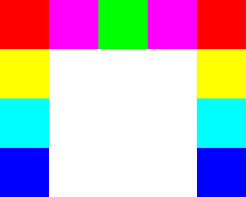

---

### 2. Conversão para Escala de Cinza

Aplica a **ponderação luminosa** (luma), que aproxima a sensibilidade diferencial do olho humano a cada cor:

```
Y = 0.299·R + 0.587·G + 0.114·B
```

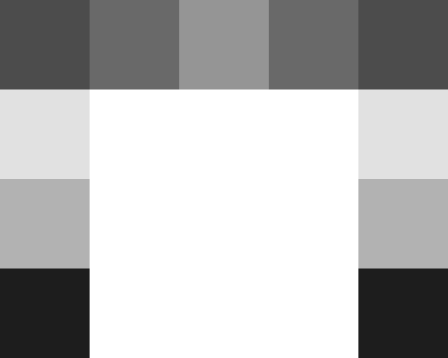

---

### 3. Binarização

Compara cada pixel a um **limiar fixo** (`230`). Pixels abaixo → 0 (preto); acima ou igual → 255 (branco).

```python
pixel < limiar  → 0
pixel >= limiar → 255
```

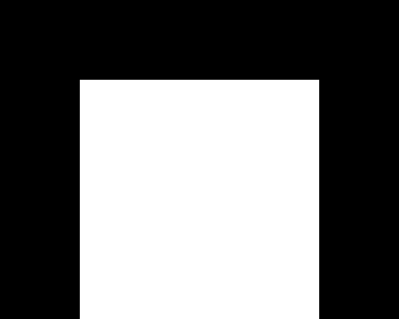

---

### 4. Alargamento de Histograma

Mapeia o intervalo `[min, max]` da imagem para `[0, 255]`, aumentando o contraste:

```
pixel_novo = (pixel - min) × (255 / (max - min))
```

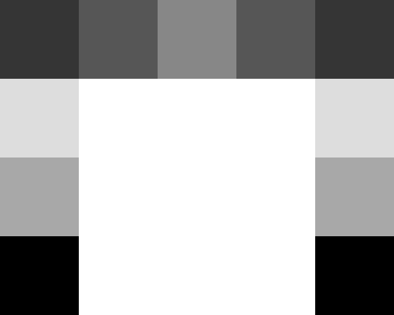

---

### 5. Quantização

Reduz de 256 para `8` tons, atribuindo cada pixel ao **centróide do seu intervalo**:

```
nível     = pixel // intervalo
centróide = (nível × intervalo) - (intervalo / 2)
```

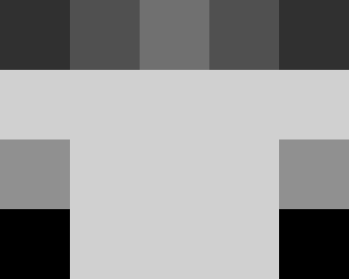

---

### 6. Histograma

Dois histogramas são gerados da imagem quantizada:

| Eixo 0–7 (tons quantizados) | Eixo 0–255 (intensidades originais) |
|---|---|
| .png) | .png) |

---

### 7. Equalização de Histograma

Redistribui os tons para achatar o histograma e aumentar o contraste global:

| Etapa | Fórmula |
|---|---|
| Probabilidade | `P[k] = Q[k] / total` |
| Prob. acumulada | `Ac[k] = Σ P[0..k]` |
| Novo nível | `Ar[k] = round(Ac[k] × (tons - 1))` |

| Antes | Depois |
|---|---|
| .png) | 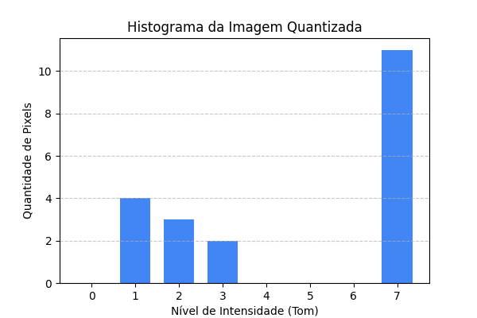 |

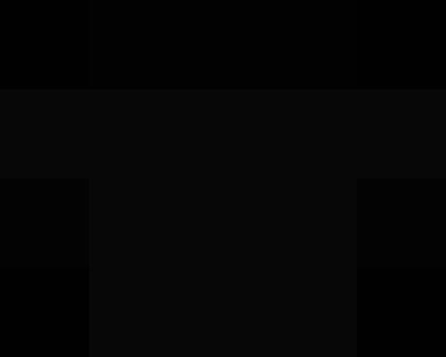

---

### 8. Filtros no Domínio Espacial

Implementados via **convolução manual** com janela 3×3 e padding de zeros.

#### Filtro de Média — Passa-Baixa

```
Kernel = (1/9) × [[1,1,1],[1,1,1],[1,1,1]]
```

Suaviza calculando a **média dos 9 vizinhos**. Atenua ruído e detalhes finos.

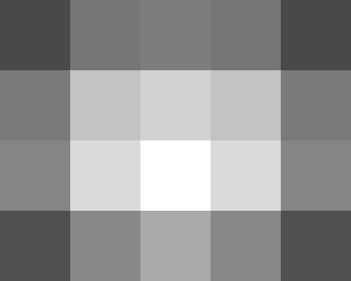

#### Filtro Laplaciano — Passa-Alta

```
Kernel = [[ 0,-1, 0],[-1, 4,-1],[ 0,-1, 0]]
```

Detecta **bordas e transições abruptas** via segunda derivada discreta.

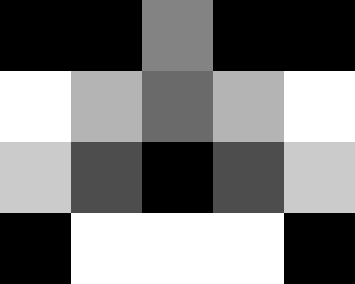

---

### 9. Filtros no Domínio da Frequência (Fourier)

Multiplica diretamente no espectro, equivalente à convolução pelo Teorema da Convolução:

```
Imagem → FFT2D → fftshift → × Máscara H(u,v) → ifftshift → IFFT2D → |resultado|
```

A máscara é binária: 1 onde a distância ao centro do espectro é ≤ D₀ (passa-baixa) ou > D₀ (passa-alta).

| Passa-Baixa (freq) | Passa-Alta (freq) |
|---|---|
| .png) | .png) |

---

## Script 2 — Ruídos e Detecção (`simular_ruido.py`)

Recebe uma imagem real (`assets/ruidos/original.jpg`), simula dois tipos de ruído e aplica filtros de remoção e detecção de estruturas.

---

### 1. Ruído Sal-e-Pimenta

Pixels escolhidos aleatoriamente viram **0 (preto) ou 255 (branco)** com 50% de chance cada. Intensidade configurada em **15%** dos pixels.

.png)

---

### 2. Ruído Uniforme

Pixels escolhidos aleatoriamente recebem um **valor aleatório entre 0 e 255**. Também com 15% de intensidade.

.png)

---

### 3. Remoção de Ruído — Filtro de Média

Aplica o **filtro de média 3×3** (mesmo do Script 1) sobre cada imagem ruidosa.

| Média sobre Sal-e-Pimenta | Média sobre Uniforme |
|---|---|
| 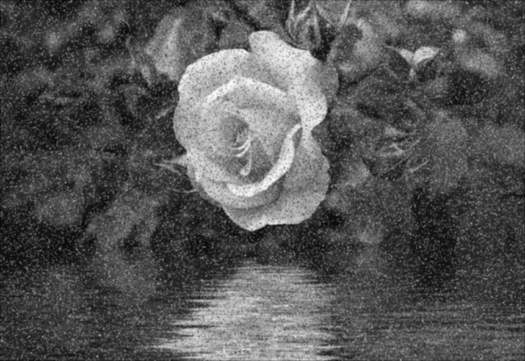 | 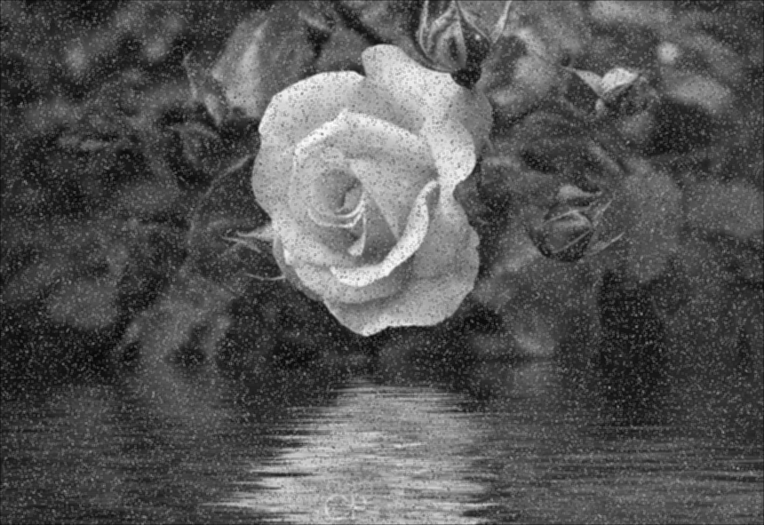 |

---

### 4. Remoção de Ruído — Filtro de Mediana

Substitui cada pixel pela **mediana dos 9 vizinhos**. Mais eficaz que a média para ruído sal-e-pimenta pois não é afetado por valores extremos.

| Mediana sobre Sal-e-Pimenta | Mediana sobre Uniforme |
|---|---|
| 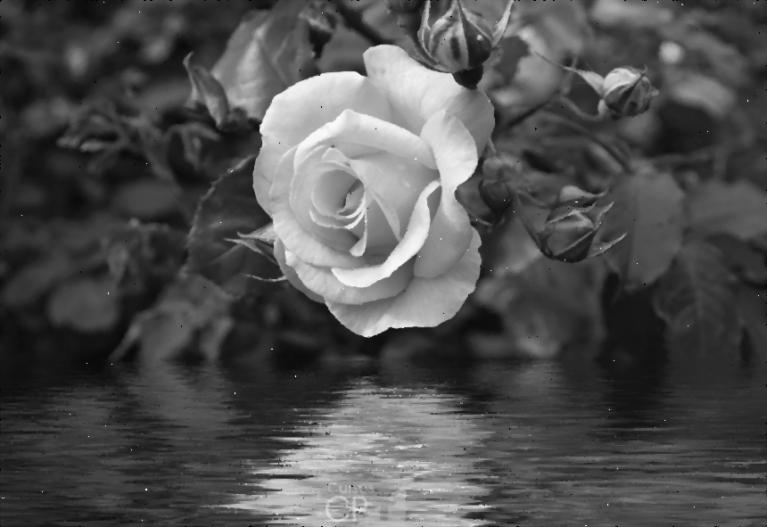 | 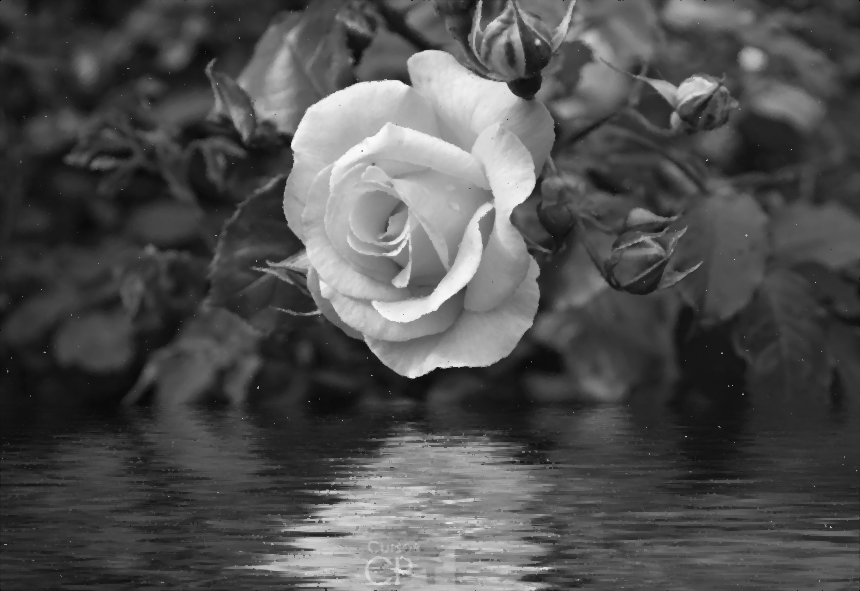 |

---

### 5. Detecção de Pontos

Laplaciano de 8 vizinhos — realça **pontos isolados** (diferem dos 8 vizinhos em todas as direções):

```
Kernel = [[-1,-1,-1],[-1, 8,-1],[-1,-1,-1]]
```


---

### 6. Detecção de Linhas

Dois kernels direcionais baseados em diferenças entre linhas opostas:

| Linhas Horizontais | Linhas Verticais |
|---|---|
| `[[-1,-1,-1],[2,2,2],[-1,-1,-1]]` | `[[-1,2,-1],[-1,2,-1],[-1,2,-1]]` |
| 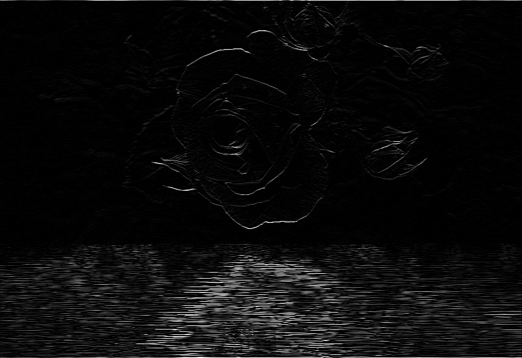 | 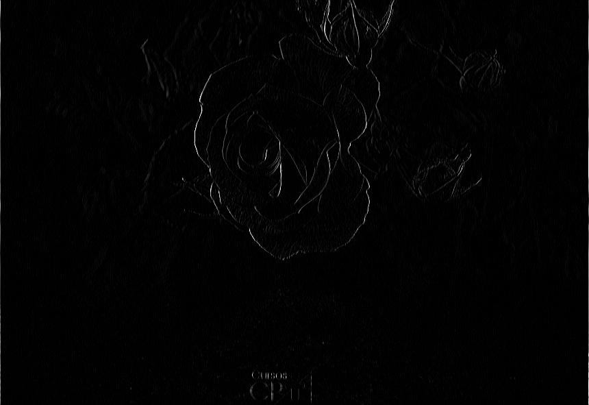 |

---

### 7. Detecção de Bordas — Magnitude do Gradiente

Combina as respostas horizontal e vertical pelo **módulo do gradiente**:

```
Bordas = √(H² + V²)
```

Equivalente ao operador de Prewitt aplicado nas duas direções.

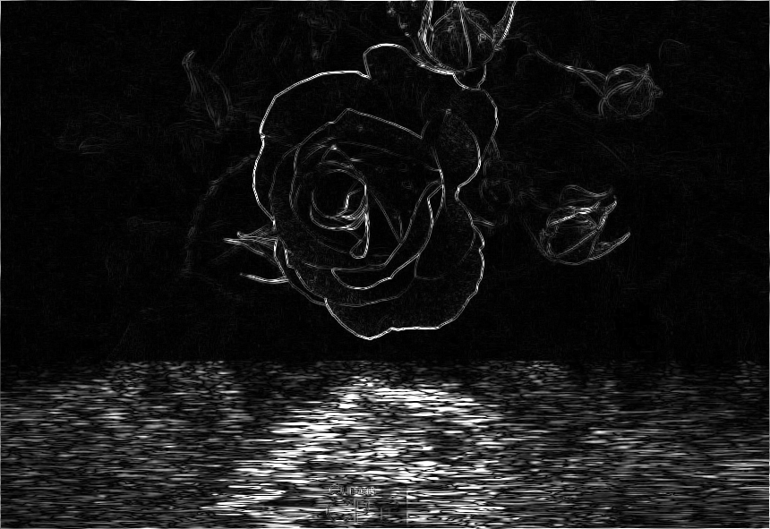

---

## Observações Técnicas

- Todos os algoritmos usam **loops explícitos** — sem `cv2.filter2D`, `cv2.equalizeHist` ou similares — para fins didáticos.
- O redimensionamento usa `INTER_NEAREST` para preservar os pixels originais sem suavização.
- Os filtros de Fourier usam `fft2` + `fftshift`/`ifftshift` para centralizar corretamente o componente DC antes de aplicar a máscara.
- A magnitude do gradiente (`bordas`) é convertida para `uint8` após `valid_color` para evitar warning de dtype no `cv2.imwrite`.

---

*Disciplina: Processamento de Imagem e Visão Computacional — UERN*
